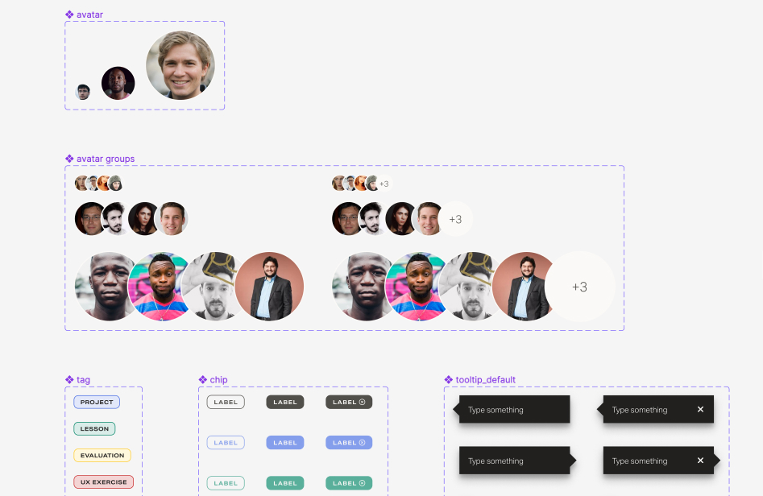
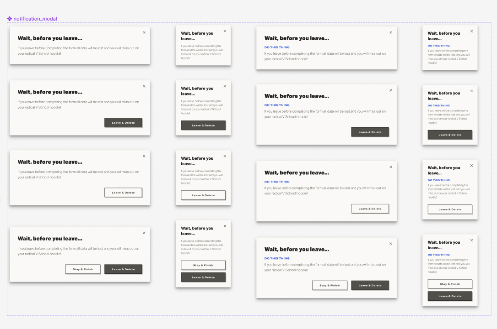
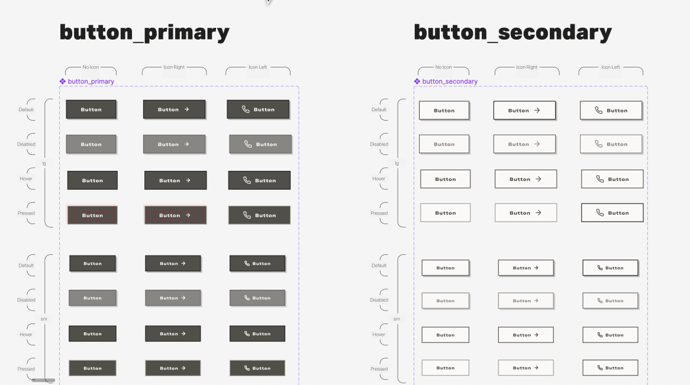
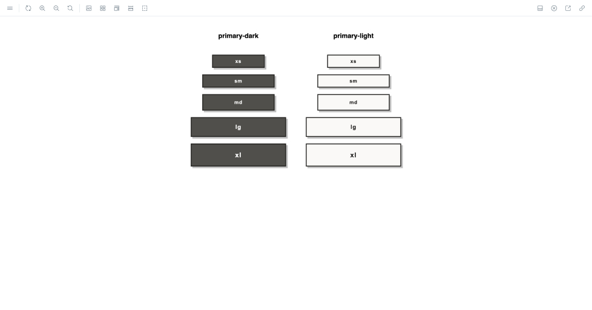
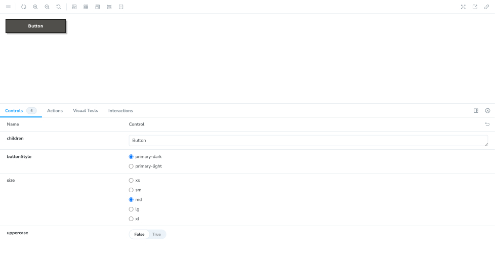

### Component library

As a Frontend Engineer for [Vschool](https://vschool.io/), as side from getting to build out pages to support the Marketing team, I had the opportunity to build out and maintain components for Lotus Design System's component library.

#### Figma

The design system incorporated more than 20 UI components such as avatar, status chip, and form components.

#### Storybook

I leveraged Storybook to build, maintain, and document components in the library.

