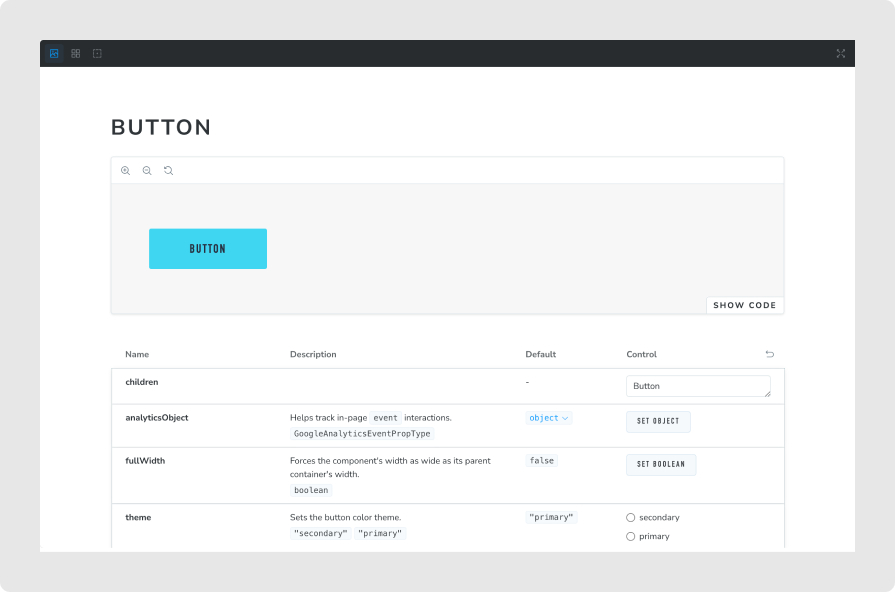
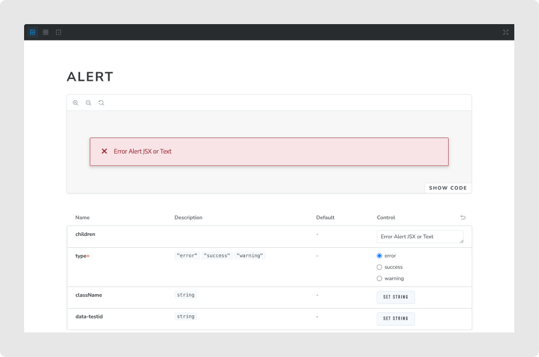
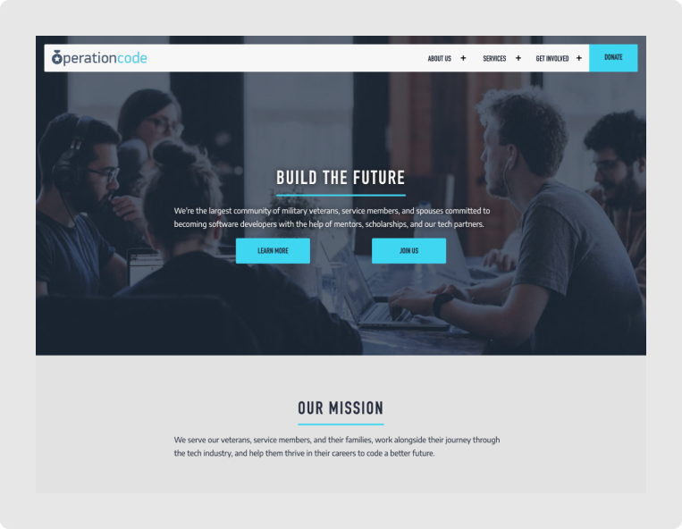

[Operation Code](https://operationcode.org/) is a non-profit that provides assistance and mentorship to service members and veterans, and their dependents, that are transitioning into tech.

The [front-end repo](https://github.com/OperationCode/front-end) is an open source effort that is maintained by volunteer contributors. The web technologies used in this project are **Next.js** and **Typescript** for the front end. For testing **react-testing-library**, **Jest**, **Vitest**, and **Cypress** for testing.

### Typescript migration

While maintaining the component library after the recent migration of the codebase to the **Next.js** framework, I got the opportunity to migrate the components in the component library to **Typescript** by adding types and updating tests and stories.

#### Components in the wild

Some examples of the component library being used across the site.

