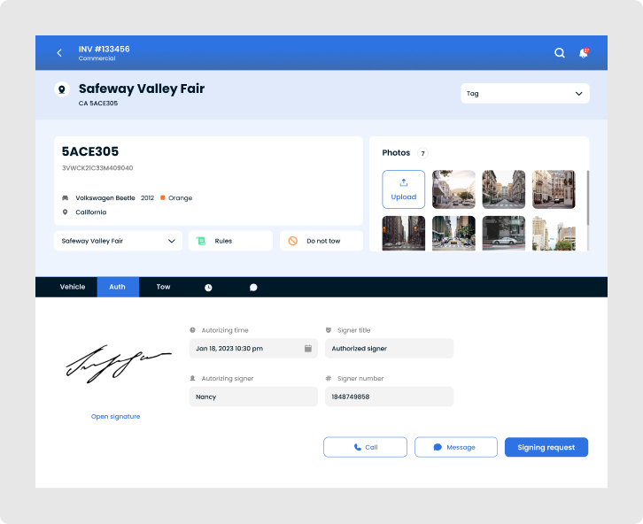

Following the success of designing and developing the Rocket Auction app, the same folks asked me to do a re-design of their [Tow Club](https://www.tow.club/) app.

Tow club is an app that allows towing companies to dispacth drivers, and monitor the status and location of tows and reference previous tow details.

### Login page

My goal was to try to keep the user's attention on the task of completing the form to log in. So, I replaced the huge logo with one that is smaller and included the app's name.

#### Updated form

Applying a white background to the form provided a more accessible user experience as it allowed the inputs, labels, and the primary call to action to contrast well with the background color.

#### Button color

For the call to action, I applied the primary color for consistency.

#### Desktop view

The original app was not responsive, and did not have a layout for devices larger than mobile. To keep focus on the form on larger screen widths, I applied a two column layout - separating the form and the logo.

### Dashboard revamp

The dashboard provides the user with the ability to create, or edit, towing dispatches and tags.

#### Commonly used actions

Adding new Tags and Dispatches were the most used actions on this page, so I moved these buttons into the page heading so they are quickly visible to the user.

#### Button spacing

The original buttons were so close together, they presented the risk of users pressing the wrong button. Applying a two column layout for the buttons provided padding between each, and a more uniform feel.

### Towing tags

The Tags page had similar issues with the UI.

#### Button spacing

Again, applying a two column layout provided some spacing between the buttons - lowering the risk of pressing the wrong button, and provided a bit of "breathing room" around the buttons.

#### List items

The details for the list items felt like they could use some spacing, and styling for IA. To create separation between list items, I created cards that used color and font weight to express the importance level of information.

#### Updated pagination

The original list pagination looked more like a system bar, and was nowhere else in the app. The pagination only used arrows, so the user had no idea where they were in the list.

I replaced it with a more a pagination component that

#### Desktop view

I also added a desktop view which displays the list items in a table with the replaced pagination component.

### Invoices

There was a lot of content on the Invoice pages. A goal of mine here to imporive usability was to group like content.

### Field camera

A requested feature was an integrated field camera. In the previous version, users would have to use a different app to take a picture of a vehicle, and manually upload it from their device.

#### Interface

For safety concerns, tow truck drivers typically spend as little time outside of their vehicle as possible, so I wanted to create a camera interface that was quick to use and free of distractions.

##### Clear shutter button

The shutter button is easily visible and reachable regardless of phone orientation.

##### Quick close

Users can quickly close the camera by using the non-invasive close button.

##### Less distractions from secondary actions

Tow truck drivers needed to take pictures of damage to document what was pre-existing damage, or something they caused. The user can quickly switch how the image is saved (Violation, or Damage) by pressing one of the transparent buttons that do not interfere with the image.

#### Review images

Users have the ability to view a gallery of pictures and remove any unwanted images.

