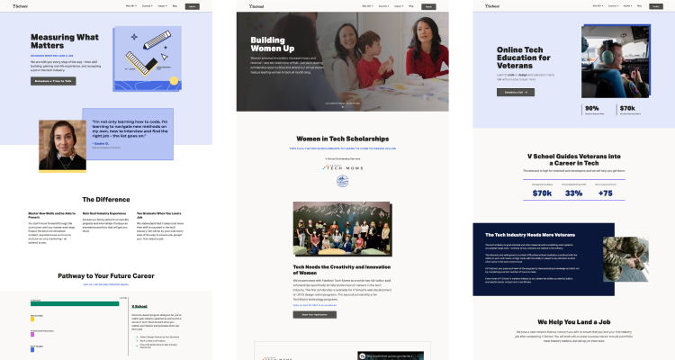

### Marketing pages

As a Frontend Engineer for [Vschool](https://vschool.io/), I built out several landing and marketing pages. The site is a static generated site for speed using **Gatsby** and **React.js**.

 

Using **graphQL** to query data from **Prismic**, we implemented a headless Content Management System (CSM) so that non-technical team members from Marketing could add/edit content images and copy.
