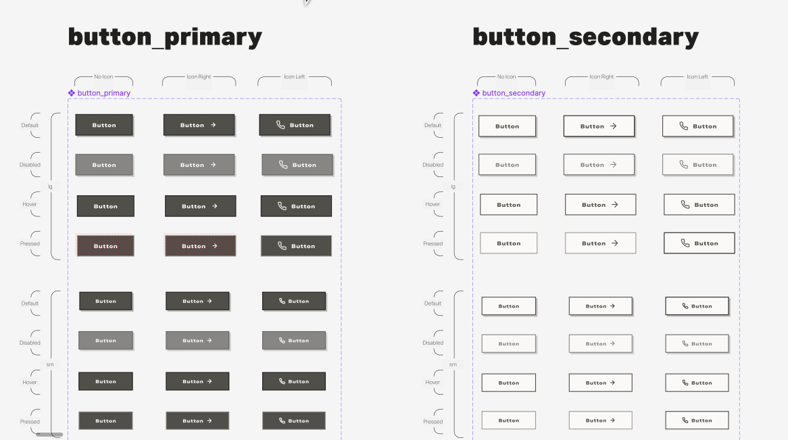
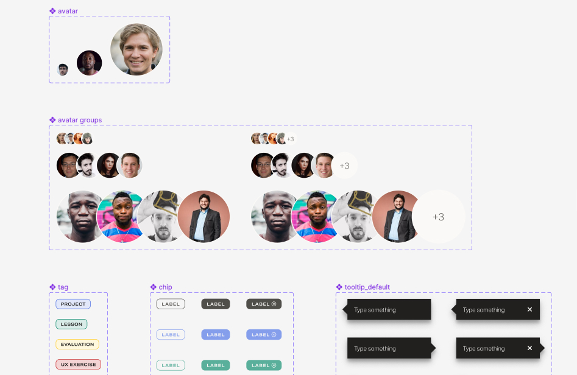

### Marketing pages

As a Frontend Engineer for [Vschool](https://vschool.io/), I built out several landing and marketing pages. The site is a static generated site for speed using **Gatsby** and **React.js**.

 

Using [graphQL](https://graphql.org/) to query data from [Prismic](https://prismic.io/), we implemented a headless Content Management System (CSM) so that non-technical team members from Marketing could add/edit image and copy content.

### Component library

Another duty I was tasked with was building out, and maintaining, the component library that was part of the newly implemented Lotus Design System.

#### Components

The design system incorporated more than 20 components, ranging from buttons used in forms...

 

<!-- #### Others -->

... and other UI elements.

 
